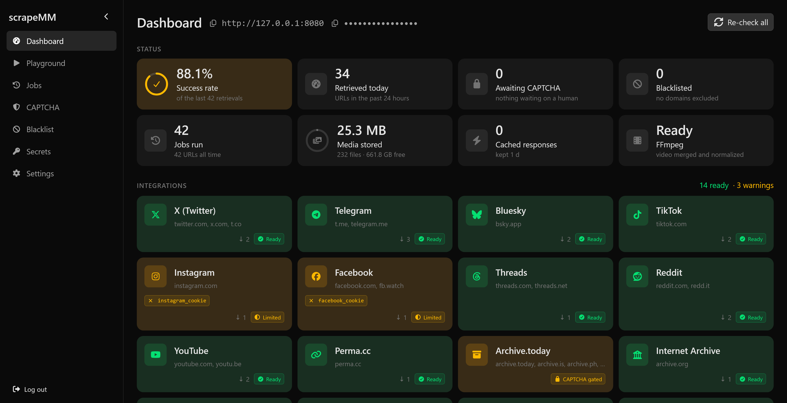

<p align="center">
  
</p>

# scrapeMM: Multimodal Web Scraper



scrapeMM is a scraping service that supports the retrieval of _multimedia content_,i.e., text, images, and videos. For a given URL, scrapeMM returns you the webpage's content as a sequence of Markdown-formatted text and in-line media. scrapeMM supports all major social media platforms, archiving services, and most of the open web.

This project is being developed by the [Multimodal AI Lab at TU Darmstadt](https://www.informatik.tu-darmstadt.de/mai/multimodal_ai/index.en.jsp) for agentic web retrieval with media support. While its primary focus is fact-checking, scrapeMM can be used for any kind of web retrieval tasks.

## Contents
- [🌐 Supported Platforms](#-supported-platforms)
  - [📱 Social Media](#-social-media)
  - [📦 Archiving Services](#-archiving-services)
- [🏗️ Architecture](#-architecture)
- [🚀 Running a server](#-running-a-server)
  - [⚙️ What is in `.env`](#-what-is-in-env)
  - [🦭 Running under Podman](#-running-under-podman)
- [🐍 Using the client](#-using-the-client)
  - [🖼️ Media on one machine is never copied](#-media-on-one-machine-is-never-copied)
- [🖥️ The web UI](#-the-web-ui)
- [⚡ Caching](#-caching)
- [🤖 CAPTCHAs and blacklisted domains](#-captchas-and-blacklisted-domains)
- [🏃 Speeding up retrieval](#-speeding-up-retrieval)
- [🔍 How it works](#-how-it-works)

## 🌐 Supported Platforms
Next to most parts of the open web, the following platforms are supported too:

### 📱 Social Media
- ✅ X/Twitter
- ✅ Telegram
- ✅ Bluesky
- ✅ TikTok
- ✅ YouTube
- ✅️ Instagram: works for most content
- ✅️ Facebook
- ✅ Threads: posts only (profiles TBD)
- ✅ Reddit: posts only

### 📦 Archiving Services
- ✅ Perma.cc
- ✅ Archive.today
- ✅ MediaVault (mvau.lt)
- ✅ Internet Archive (web.archive.org)
- ✅ AwesomeScreenshot.com
- ✅ Ghostarchive (ghostarchive.org)


## 🏗️ Architecture
scrapeMM is split in two:

* **The server** does the scraping. It runs as a Docker container with a web UI for
  configuring integrations, watching their status, trying URLs and solving CAPTCHAs.
* **The client** is the `scrapeMM` package on PyPI. It talks to the server over API requests.

In its core, scrapeMM is a layer on top of the scraping services [Firecrawl](https://github.com/mendableai/firecrawl)
and [Decodo](https://decodo.com/), with additional integrations for social media and
archiving services. Media are handled with in-line references in the Markdown string, managed by [ezMM](https://github.com/multimodal-ai-lab/ezmm).

## 🚀 Running a server
Copy the `.env.example` file to `.env` and edit it to suit your needs. Then, run
```bash
docker compose up -d
```
to start the server's docker containers. The web UI is then at `http://localhost:[SCRAPEMM_PORT]`. It asks
for the API key: set `SCRAPEMM_API_KEY` in `.env`, or leave it empty and the server
generates one on first start and prints it to the log (`docker compose logs scrapemm`).

That one command also starts a self-hosted Firecrawl. Further instances can be added in
the UI under **Settings**.

Then configure the integrations in the UI under **Secrets** — the dashboard tells you
which ones are missing what.

### ⚙️ What is in `.env`

| Variable | Meaning                                                                                                                                           |
|---|---------------------------------------------------------------------------------------------------------------------------------------------------|
| `SCRAPEMM_PORT` | Port for the web UI and the API                                                                                                                   |
| `SCRAPEMM_API_KEY` | The bearer token for both; generated if empty                                                                                                     |
| `SCRAPEMM_CONFIG_DIR` | Where the server keeps secrets, caches, job history, browser profile                                                                              |
| `SCRAPEMM_MEDIA_DIR` | The ezMM media directory downloaded media goes to; Must be an **absolute, Docker-mountable path** on the host system |
| `SCRAPEMM_BEHIND_TLS` | Set to `1` when a reverse proxy terminates HTTPS                                                                                                  |

⚠️ Secrets are typed into the web UI, so they cross the network. On anything but
localhost, put HTTPS in front of the server; it warns at startup when you have not.


## 🐍 Using the client

```bash
pip install scrapeMM
```

```python
import asyncio
import scrapemm

scrapemm.configure(api_url="http://localhost:8080", api_key="...")

url = "https://www.snopes.com/fact-check/gauze-originate-from-gaza/"
result = asyncio.run(scrapemm.retrieve(url))
print(result.get() if result.success else result.errors)
```

`configure()` only needs to run once per machine: it saves its settings to
`%APPDATA%\scrapeMM\client.json` on Windows, or `~/.config/scrapeMM/client.json`
elsewhere, and later processes load them from there. Pass `persist=False` to change the
running process only. `SCRAPEMM_API_URL` and `SCRAPEMM_API_KEY` in the environment
override the saved values.

`retrieve()` returns a `ScrapingResponse`. `result.get()` gives the content in the
requested format; `result.content` exposes every format produced along the way:

| Attribute | Type | Content |
|---|---|---|
| `result.content.html` | `str` | The raw HTML of the page |
| `result.content.markdown` | `str` | The page text in Markdown, media by hyperlink |
| `result.content.multimodal` | `MultimodalSequence` | The page text with all media downloaded and embedded |

Choose with `output_format` (default `"multimodal"`):

```python
result = asyncio.run(scrapemm.retrieve(url, output_format="html"))
```

The formats are produced in order — HTML, then Markdown, then the `MultimodalSequence` —
and scraping stops at the one you asked for. So earlier formats come along for free
whenever the method had access to them, nothing beyond it is computed, and media is
downloaded only for `"multimodal"`. `result.success` says whether the requested format
could be produced.

Pass a list of URLs to retrieve them concurrently; results come back in the order you
asked for them, and a progress bar fills in as each one lands:

```python
results = asyncio.run(scrapemm.retrieve([url_a, url_b, url_c]))
```

Failures arrive as the exception classes you would catch in-process:

```python
from scrapemm import CaptchaEncounteredError, RetrievalFailed

if not result.success:
    for method, error in result.errors.items():
        if isinstance(error, CaptchaEncounteredError):
            ...
```

### 🖼️ Media on one machine is never copied

When the client runs on the same machine as the server — the usual case for a pipeline
sitting next to its scraper — the media it gets back are *the server's own files*. No
second copy of every image and video is made.

The client works out how to do this per server:

| Mode | When | What happens |
|---|---|---|
| `shared` | Client and server use the same ezMM registry (`EZMM` points at the same directory) | Nothing. The references are already valid. |
| `link` | The server's media directory is readable here | Its files are registered by path. Not a byte is copied. |
| `download` | The server is genuinely elsewhere | The bytes come over the API. |

For `shared` or `link` to work, set `SCRAPEMM_MEDIA_DIR` in the server's `.env` to an
**absolute** path — ideally your clients' `ezMM` directory, which gives you `shared`. With
a relative path the server cannot tell clients where the files are on the host, so they
fall back to `download`.

Override the choice with `scrapemm.configure(media_transfer="download")` if you want the
bytes copied anyway — for instance when the media directory is on a read-only mount, or
when you want files that outlive the server's.

⚠️ In `link` mode your items point into the server's media directory. The server never
deletes media on its own, precisely so that those references keep working; prune it
yourself when you decide to, and expect older sequences to lose their media when you do.

## 🖥️ The web UI

| Page | What it is for |
|---|---|
| **Dashboard** | Whether each retrieval method can be used right now, and which secret it is missing if not. Plus FFmpeg, the browser and disk usage. |
| **Playground** | Try URLs and watch the results stream in, rendered with their media. |
| **Jobs** | Every retrieval this server has run, with per-URL outcomes and the content it produced. |
| **CAPTCHA** | The backlog of gated URLs, and the solver panel. |
| **Secrets** | Set the API credentials. Write-only: the server never gives a value back. |
| **Settings** | Firecrawl endpoints, hedging, cache and blacklist lifetimes, the domain blacklist. Regenerating the API key (unless `SCRAPEMM_API_KEY` sets it). |

Every card on the dashboard carries its own status colour and names the missing secrets
as chips you can go and fill in. Firecrawl and Decodo get cards too, even though they are
scraping methods rather than per-platform integrations, and each card counts the URLs it
has retrieved.

| Colour | Means |
|---|---|
| Green — *Ready* | Works. |
| Amber — *Limited* | Works for public content; an **optional** cookie would unlock more. Facebook and Instagram sit here without their cookies. |
| Amber — *CAPTCHA gated* | The service is up but behind a check right now. Archive.today spends most of its time here; solving one check in the panel clears it. |
| Amber — *Unreachable* | Configured, but not answering. |
| Red — *Not configured* | A **required** credential is missing. |
| Gray — *Disabled* | Switched off deliberately. |

**Switching a method off.** The ⋮ menu on each card disables it. A disabled method is
dropped from the method list before retrieval rather than left to fail its way down it,
so it costs nothing at all — useful for a paid API you are done spending on, or an
integration that is misbehaving today. If every method that could handle a URL is
disabled, the error says so rather than claiming the URL is unsupported.

Secrets are encrypted at rest with a key the server generates for itself on first start;
nobody has to manage it. Set `SCRAPEMM_MASTER_KEY` if you would rather keep that key out
of the volume. Note what this does and does not buy you: the ciphertext is useless in a
backup or a volume snapshot, but anyone who can read the config directory can decrypt it,
because the server has to be able to as well.

## ⚡ Caching

Successful retrievals are cached in memory for 24 hours, so scraping the same URL again is
instantaneous. `result.from_cache` tells you whether a response came from the cache, and
`retrieve(url, use_cache=False)` bypasses it for one call. Change the lifetime under
Settings, or clear the cache there.

## 🤖 CAPTCHAs and blacklisted domains

Every scraped page is checked for CAPTCHA challenges (Cloudflare, reCAPTCHA, hCaptcha,
DataDome, AWS WAF, PerimeterX and others). If a challenge was served instead of the page,
the response carries a `CaptchaEncounteredError` and the domain goes on a blacklist;
retrieving any URL of that domain then fails right away with an `UnsupportedDomainError`
saying why.

A domain is blacklisted only if *all* methods failed, so a CAPTCHA on one method does not
exclude a domain another method can still scrape. Automatic blacklistings **expire after 7
days** — CAPTCHA gates are often transient, and excluding a domain forever would quietly
erode coverage. Domains you add yourself under Settings are permanent: they express a
decision, not an observation. Domains served by an integration (`perma.cc`,
`archive.today`, `x.com`, …) are never blacklisted automatically, since that would disable
the integration for good.

## 🏃 Speeding up retrieval

By default the server tries its retrieval methods one after another, so a slow method
delays every method behind it by its full timeout. **Hedging** gives each method only a
head start instead: once the delay elapses the next is launched *alongside* it, the first
success wins, and the rest are cancelled.

```python
result = asyncio.run(scrapemm.retrieve(url, hedging_delay=5))
```

Set it server-wide under Settings. It is off by default because it duplicates work — and,
for paid methods such as Decodo, duplicates billable requests.

## 🔍 How it works

```
Input:                                  Output:
URL (string)   -->   retrieve()   -->   MultimodalSequence
```

The `MultimodalSequence` is a sequence of Markdown-formatted text and media provided by the
[ezMM](https://github.com/multimodal-ai-lab/ezmm) library.

Web scraping is done with [Firecrawl](https://github.com/mendableai/firecrawl) and
[Decodo](https://decodo.com/), alongside per-platform integrations.

Media is collected from `` and `<video>` tags, from CSS background images, and from
embedded players of the common video platforms (an `<iframe>` pointing at YouTube, Vimeo,
Dailymotion, …), which are downloaded with yt-dlp. `max_video_size` caps every one of those
downloads; oversized videos are skipped without downloading a byte whenever the server
announces a `Content-Length`.

Images are taken at their highest available resolution: `srcset` candidates are compared and
lazy-loading attributes (`data-src`, `data-lazy-src`, `data-original`, …) are honoured, so
pages that ship a placeholder in `src` still yield their real media. Media references are
resolved against the page URL, whether absolute, protocol-relative (`//cdn/x.jpg`),
root-relative (`/x.jpg`) or document-relative (`img/x.jpg`).
